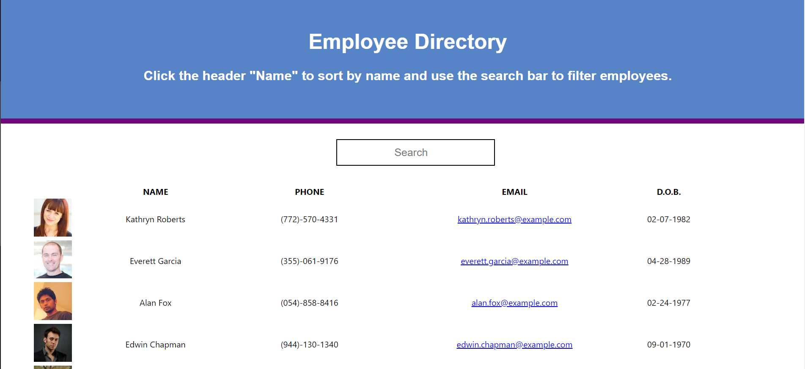

# Employee-Directory 

## Description
This application uses React and a third party API ([Here](https://randomuser.me/)) to show a table of mock employees with random headshots, names, phone numbers, emails, and dates of birth. When the user clicks on "Name" then the list of employees will be ordered alphabetically by first name. There is also a search bar implemented so that the user can search employees by name, phone number, or email address. Because this is a react app, it will update the list of employees as the user is typing without having to press a search button.
### Table of Contents
-  [Title](#title)

-  [Description](#description)

-  [Installation](#installation)

-  [Usage](#usage)

-  [License](#license)

-  [Contributors](#contributors)

-  [Questions](#questions)
            
## Installation
There is no installation required since this app is deployed on github pages. The link to the deployed site is [here](https://reedsantos.github.io/employee-directory/?).
## Usage
When the user opens the app, then they are presented with a table of employees  
When the user clicks on "name", then all users are sorted alphabetically by first name   
When the user types into the search bar, then the table will automatically filter employees as the user types  
When the page is refreshed, then the table will populate itself with new random employees.

## License

## Contributors
No contributors yet but feel free to make a pull request.

## Questions
If anyone has any questions about my application please contact me below.

reedsantos@icloud.com

[Github link](https://github.com/ReedSantos)
